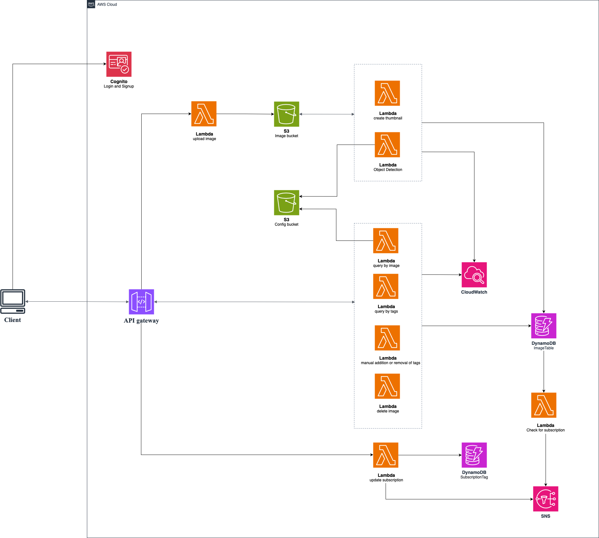
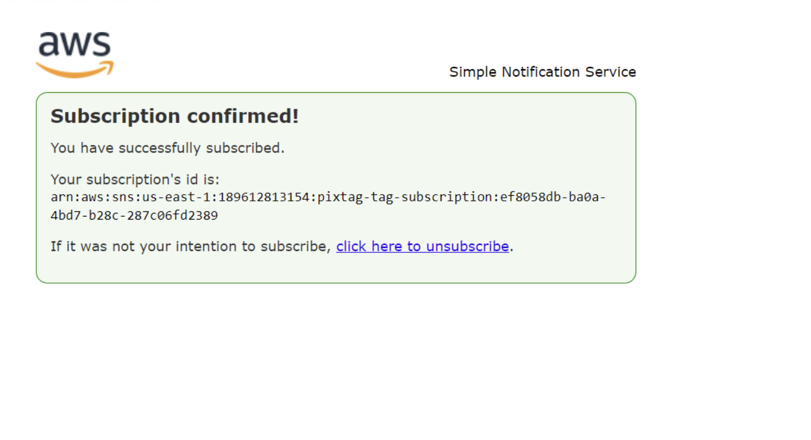

# PixTag - Serverless Image Storage System

> PixTag is a serverless image storage system built on AWS, designed to allow users to upload, tag, and query images using object detection and image metadata. The system is powered by OpenCV and YOLO and follows a modular architecture with frontend and backend components.

## 🚀 System Architecture


The system is composed of the following AWS services:
- Cognito: Authentication  
- API Gateway: Entry point  
- Lambda: Image processing, tagging, querying, notifications  
- S3: Image/config storage  
- DynamoDB: Image metadata and subscriptions  
- SNS: Notification system  
- CloudWatch: Log management

## ✨ Features
📤 Image upload and S3 storage  
🔍 Object detection and automatic tagging  
🏷️ Manual tag management  
🖼️ Thumbnail generation  
🔎 Query images by tags or similar image  
🔔 Tag-based subscription notifications  
🔐 Cognito-based user authentication  
☁️ Fully serverless and scalable architecture  

## 🎯 User Guide
1. Register/Login with AWS Cognito.
2. Upload images to trigger thumbnail creation and object detection.

3. Query by tags (can use comma to separate tags).

4. Query by image similarity (auto-extracted tags from uploaded image).

5. Add or remove tags manually.
6. Delete images.
7. Tag subscription: receive emails on matching uploads.



## 🛠️ Tech Stack
### Frontend
- React with TypeScript
- Material-UI (MUI) for UI components
- Vite for build and development
- AWS Cognito for authentication

### Backend
- AWS Lambda for serverless functions
- API Gateway for REST endpoints
- DynamoDB for metadata storage
- S3 for image storage
- SNS for notifications
- OpenCV for image processing

## 📁 Project Structure
```
PixTag/
├── src/                       # Frontend source code
│   ├── api/                   # API integration
│   ├── config/                # Configuration files
│   ├── pages/                 # React page components
│   ├── router/                # React router configuration
│   └── utils/                 # Utility functions
├── Lambda/                    # AWS Lambda functions
├── yolo_tiny_configs/         # YOLO model configurations
└── package.json               # Frontend dependencies
```

### 🔑 Key Components
- Image Processing
    - `image_processing_function.py`: Core image processing utilities
    - `object_detection_function.py`: Object detection implementation
    - `yolo_tiny_configs/`: YOLO model configurations for object detection
- Image Management
    - `image_upload_function.py`: Image upload handling
    - `query_image_function.py`: Image querying functionality
    - `operation_of_tags.py`: Tag management operations
- Frontend
    - React-based user interface
    - Material-UI components
    - AWS Cognito integration
    - Image upload and management interface

## 📦 Getting Started
### Prerequisites
- Node.js and npm  
- Python 3.x  
- AWS CLI credentials  
- OpenCV and YOLOv3-tiny configs

### AWS Setup
- Set up Cognito User & Identity Pools  
- Create and configure S3 buckets  
- Set up DynamoDB tables: `ImageTable`, `SubscriptionTag`  
- Create SNS topics for tag subscriptions  
- Deploy Lambda functions via AWS Console or SAM

### Installation
```bash
git clone https://github.com/alice856262/PixTag
cd PixTag
npm install
npm run dev
```

## ☁️ Deployment
The system is designed to be deployed on AWS using serverless architecture:
1. Deploy Lambda functions
2. Set up API Gateway endpoints
3. Configure S3 buckets and DynamoDB tables
4. Deploy frontend to static hosting

## 👥 Authors
| 👤 Name           | 💻 GitHub  | 🧩 Role Highlights                                                        |
|------------------|-----------------|--------------------------------------------------------------------------|
| Jianhui Ling     | @Jake177        | DynamoDB design, SNS integration, image & tag query functions            |
| Pei-Jiun Chuang  | @alice856262    | OpenCV integration, image upload pipeline, YOLO-based object detection   |
| Song Zhou        | @Nicolsonsz     | Tag operation tools, image deletion, GitHub repo setup                   |
| Mingyang Liu     | @mliu0102       | Frontend UI/UX design, Cognito auth integration, API linking             |

## 🎉 Acknowledgements
- Inspired by Monash FIT5225 Cloud Computing.
- This project is for academic and demonstration purposes only.